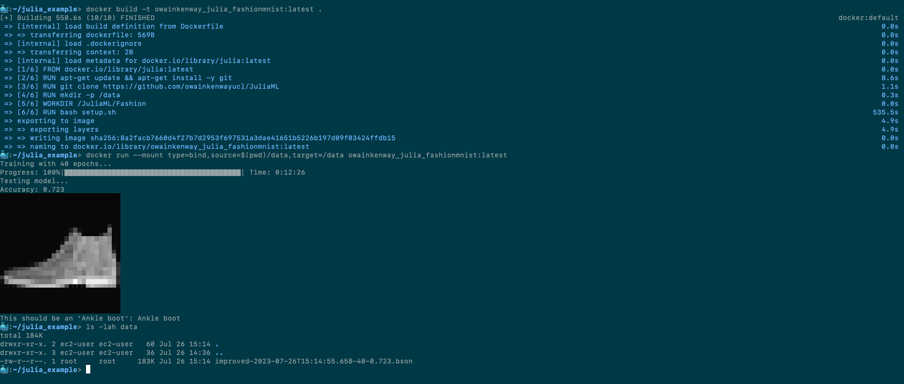

# Julia FashionMNSIT

This Dockerfile example creates an image that when run uses Flux.jl to train and then test a machine learning model on the FashionMNIST dataset.

It does this based on the official Julia Docker image, cloning [this Github repository](https://github.com/owainkenwayucl/JuliaML) and running the `setup.sh` script in that repo to install the relevant Flux.jl dependencies.

To build it:

```shell
$ docker build -t owainkenway_julia_fashionmnist:latest .
```

*(you can replace `owainkenway_julia_fashionmnist` with any name you like)*

You can then run it with:

```shell
$ docker run owainkenway_julia_fashionmnist:latest
```

If you wish to retrieve the serialised model weights from the container, you can bind mount some existing directory on the host as `/data` in the container and at the end of the run you'll be able to find it in bson format. E.g. to mount a `data` directory in the current working directory.

```shell
$ docker run --mount type=bind,source=$(pwd)/data,target=/data owainkenway_julia_fashionmnist:latest
```

Here is a screenshot of the full workflow running on an ec2 instance:


